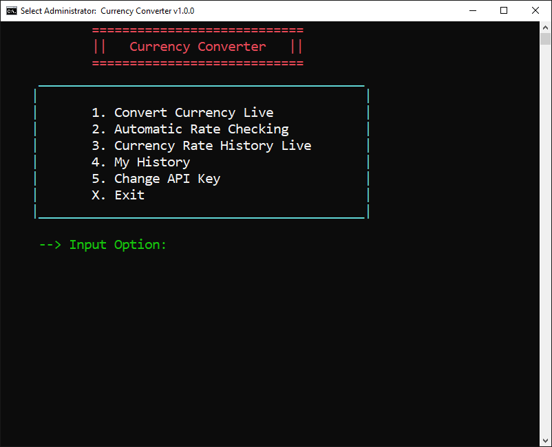
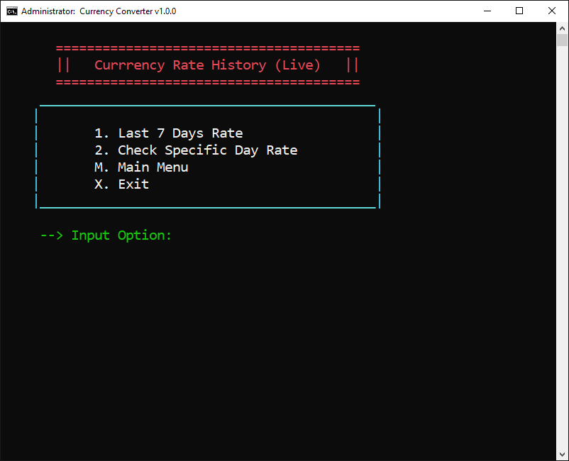
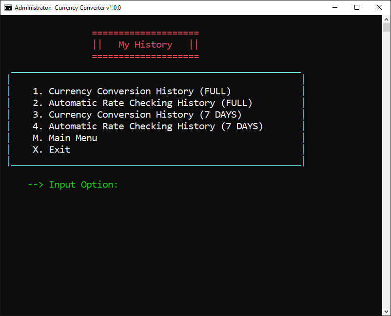

<h1 align="center">Currency Converter | C Mini Project</h1>

  <!-- Release Version -->
    
  <!-- Last Updated -->
    

  <strong>An advanced Currency Converter with minimal size and command-line interface. Written in Pure C.</strong>
   
  <strong>(Only works on Windows OS)</strong>

&nbsp;
&nbsp;
## Features
    * Convert Currency With Current Rate 
    * Check Currency Rate Automatically (Get Notification On Rate Change)
    * Last 7 Days Rate From Internet
    * Historical Date Rate
    * Full History Support
    * Check Highest Rates From History
    * and many more

&nbsp;
&nbsp;
## Drawbacks
    * Since this program using free API it has limitation of checking historical rate up to 1 year.
    * If a currency rate changes twice or more in day and we try to get that days conversion rate, most likely the rate it will return won't match with the rates from the internet.
    * In this API, currency rates get refresh after every few hour, which means conversion of currency like Bitcoin will give outdated result at 99% time.

(**NOTE:** All of them are API limitations and can be solved through the premium API.)

&nbsp;
&nbsp;
## Build instructions
Simply compile *'MainMenu.c'* with *CodeBlocks* or other IDE that has compiler, everything is already included in **bin** folder. **Or,** use GCC to compile from CMD.

    gcc MainMenu.c -oYOUR-FILE-NAME
(Make sure **bin** folder & **MainMenu.c** file are in the same directory.)

&nbsp;
&nbsp;
## References
  **Supperted API Provider:** [CurrencyConverterAPI.Com](https://free.currencyconverterapi.com)\
  **Recommended Compiler:** [TDM-GCC](https://jmeubank.github.io/tdm-gcc/download/)\
**External Libraries:**
  * [rlutil](https://github.com/tapio/rlutil)
  * [cJSON](https://sourceforge.net/projects/cjson)

&nbsp;
&nbsp;
## Demonstrational Video
")

&nbsp;
&nbsp;
## Screenshots
| Main Menu  | Historical Rate Menu | My History  |
|------------|----------------------|-------------|
|  |  | |

&nbsp;
## Need Help?
**Email:** [Md. Ehsan Khan](mailto:help.ahsan@gmail.com)/
**Email:** [Syed Eftasum Alam](mailto:salam201133@bscse.uiu.ac.bd)

